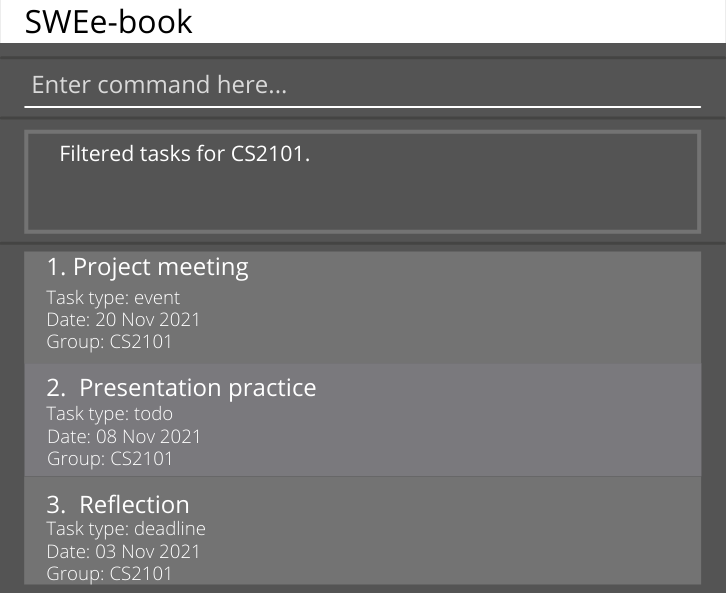

# SWEe-book
**SWEe-book** is a desktop app that makes it easier for CS2103T/CS2101 students to
**keep track of their tasks and group mates in different groups**.

### Features
1. Adding a contact
1. Editing a contact
1. Deleting a contact
1. Filtering contacts by name
1. Filtering contacts by group
1. Listing all contacts
1. Adding a task
1. Editing a task
1. Deleting a task
1. Marking a task as done
1. Sorting tasks
1. Filtering tasks by modules
1. Listing all tasks

### SWEe-book GUI

### User Guide
The User Guide can be accessed [here](https://github.com/AY2122S1-CS2103T-W12-2/tp/blob/master/docs/UserGuide.md).

### Developer Guide
The Developer Guide can be accessed [here](https://github.com/AY2122S1-CS2103T-W12-2/tp/blob/master/docs/DeveloperGuide.md).

#### Acknowledgements
This project is based on the AddressBook-Level3 project created by the [SE-EDU initiative](https://se-education.org).
