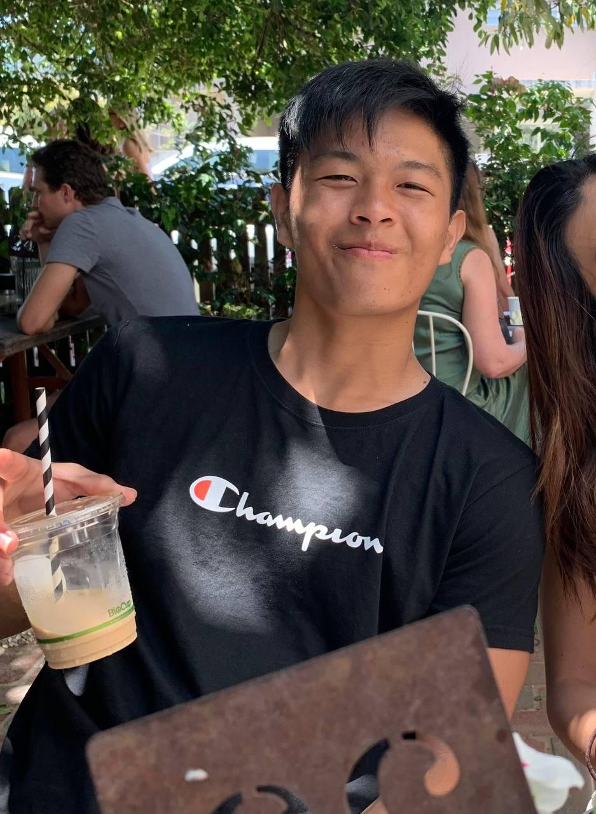

We are a team based in the [School of Computing, National University of Singapore](http://www.comp.nus.edu.sg).

You can reach us at the email `seer[at]comp.nus.edu.sg`

## Project team

### Alina Lee

[[github](https://github.com/alinaleehx)]

* Role: Documentation
* Responsibilities: Responsible for the quality of various project documents.

### Joseph Nathanael

[[github](http://github.com/JosephN37)]

* Role: Deliverables and deadlines
* Responsibilities: Ensure project deliverables are done on time and in the right format.

### Yeu Chen Yuan

[[github](http://github.com/cyyeu)]

* Role: Code quality
* Responsibilities: Ensure overall adherence to coding standards.

### Ambrose Boo

[[github](https://github.com/ambroseboo)]

* Role: Scheduling and Tracking
* Responsibilities: In charge of defining, assigning and tracking project tasks.

### Tan Zhen Xuan

[[github](https://github.com/zhenxuantan)]

* Role: UI/UX
* Responsibilities: Responsible for the UI/UX component of the SWEe-book app.
