* Table of Contents
{:toc}
---

## **Design**

### Architecture

Given below is a quick overview of main components and how they interact with each other.

**Main components of the architecture**

**`Main`** has two classes called [`Main`](https://github.com/AY2122S1-CS2103T-W12-2/tp/blob/master/src/main/java/sweebook/Main.java) and [`MainApp`](https://github.com/AY2122S1-CS2103T-W12-2/tp/blob/master/src/main/java/sweebook/MainApp.java). It is responsible for,
* At app launch: Initializes the components in the correct sequence, and connects them up with each other.
* At shut down: Shuts down the components and invokes cleanup methods where necessary.

[**`Commons`**](#common-classes) represents a collection of classes used by multiple other components.

The rest of the App consists of four components.

* [**`UI`**](#ui-component): The UI of the App.
* [**`Logic`**](#logic-component): The command executor.
* [**`Model`**](#model-component): Holds the data of the App in memory.
* [**`Storage`**](#storage-component): Reads data from, and writes data to, the hard disk.

**How the architecture components interact with each other**

The Sequence Diagram below shows how the components interact with each other for the scenario where the user issues the
command `addTask d/project meeting g/CS2101 type/event date/2021-10-10`.

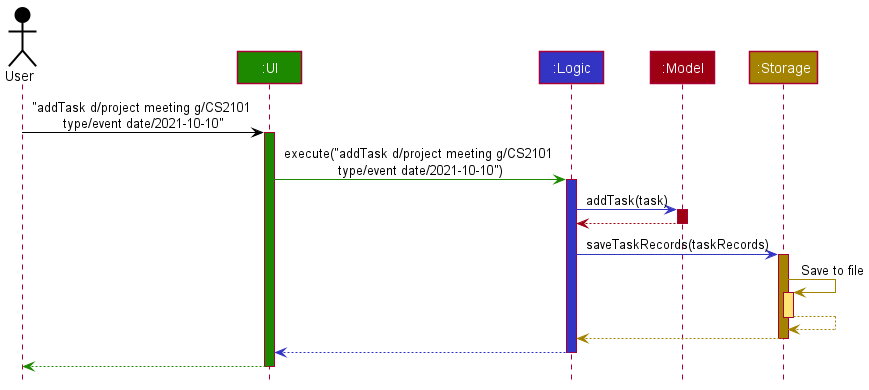

Each of the four main components (also shown in the diagram above),

* defines its *API* in an `interface` with the same name as the Component.
* implements its functionality using a concrete `{Component Name}Manager` class (which follows the corresponding API `interface` mentioned in the previous point.

For example, the `Logic` component defines its API in the `Logic.java` interface and implements its functionality using the `LogicManager.java` class which follows the `Logic` interface. Other components interact with a given component through its interface rather than the concrete class (reason: to prevent outside component's being coupled to the implementation of a component), as illustrated in the (partial) class diagram below.

The sections below give more details of each component.

### Logic component
Here's a (partial) class diagram of the `Logic` component:

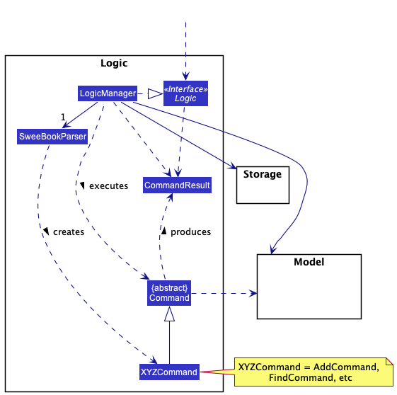

How the `Logic` component works:
1. When `Logic` is called upon to execute a command, it uses the `SweeBookParser` class to parse the user command.
2. This results in a `Command` object (more precisely, an object of one of its subclasses e.g., `AddTaskCommand`) which is executed by the `LogicManager`.
3. The command can communicate with the `Model` when it is executed (e.g. to add a task).
4. The result of the command execution is encapsulated as a `CommandResult` object which is returned back from `Logic`.

The Sequence Diagram below illustrates the interactions within the `Logic` component for the `execute("addTask d/project meeting g/CS2101 type/event date/2021-10-10")` API call.

Here are the other classes in `Logic` (omitted from the class diagram above) that are used for parsing a user command:

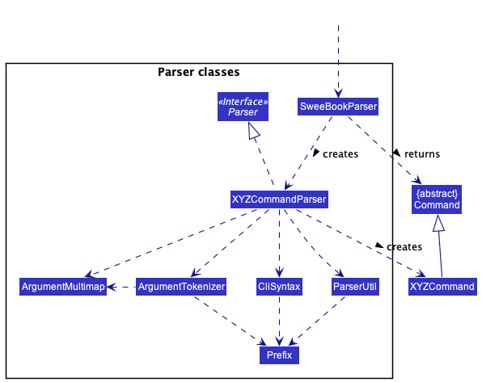

How the parsing works:
* When called upon to parse a user command, the `SweeBookParser` class creates an `XYZCommandParser` (`XYZ` is a placeholder for the specific command name e.g., `AddTaskCommandParser`) which uses the other classes shown above to parse the user command and create a `XYZCommand` object (e.g., `AddCommand`) which the `SweeBookParser` returns back as a `Command` object.

### Model component
Here is an overview of the model component.

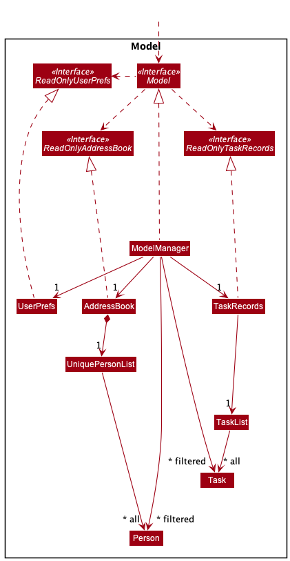

The `Model` component,

* stores the list of contacts and list of tasks (contained in UniquePersonList and TaskList respectively)
* stores the currently 'selected' `Person` and `Task` objects (e.g., results of a search query) as separate _filtered_ lists which is exposed to outsiders as an unmodifiable `ObservableList<Person>` or `ObservableList<Task>` that can be 'observed' e.g. the UI can be bound to this list so that the UI automatically updates when the data in the list change.
* stores a `UserPref` object that represents the user’s preferences. This is exposed to the outside as a `ReadOnlyUserPref` objects.
* does not depend on any of the other three components (as the `Model` represents data entities of the domain, they should make sense on their own without depending on other components)

Taking a closer look at the person and tasks models, here is the class diagram.
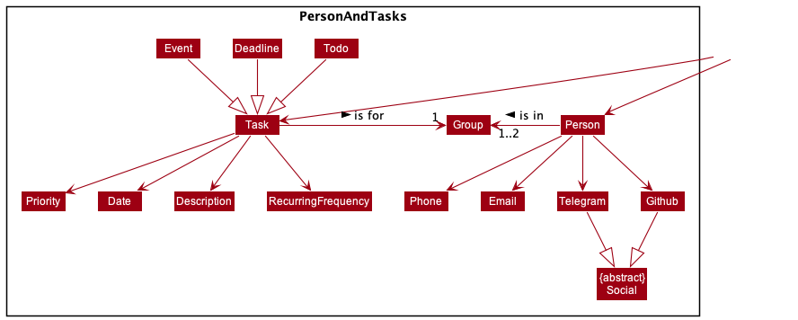

`Person` and `Task` models are similar such that,
* they share a `Group` class, which can be either `CS2103T` or `CS2101`

Specifically for `Person`,
* the model stores the phone number, email and socials
* socials refer to their Telegram and Github usernames

Lastly, specfically for `Task`,
* a task has a date (to specify a deadline or time of event), description, priority, and recurring frequency
* recurring frequency can be in terms of weekly, monthly and yearly
* priority can be low, medium or high
* a task can be instantiated as a `Todo`, `Deadlne` or `Event`

### UI component
The **API** of this component is specified in [`Ui.java`](https://github.com/AY2122S1-CS2103T-W12-2/tp/blob/master/src/main/java/seedu/address/ui/Ui.java)

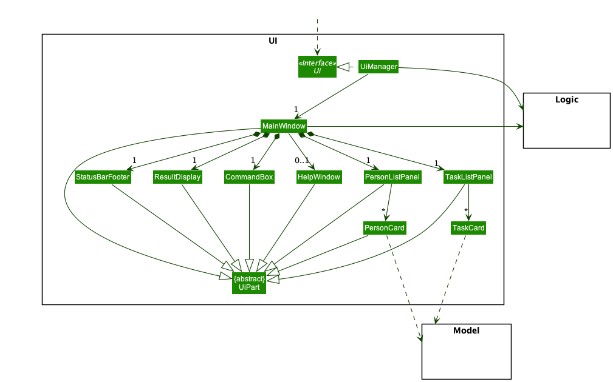

The UI consists of a `MainWindow` that is made up of parts e.g.`CommandBox`, `ResultDisplay`, `PersonListPanel`, `StatusBarFooter` etc. All these, including the `MainWindow`, inherit from the abstract `UiPart` class which captures the commonalities between classes that represent parts of the visible GUI.

The `UI` component uses the JavaFx UI framework. The layout of these UI parts are defined in matching `.fxml` files that are in the `src/main/resources/view` folder. For example, the layout of the [`MainWindow`](https://github.com/AY2122S1-CS2103T-W12-2/tp/blob/master/src/main/java/seedu/address/ui/MainWindow.java) is specified in [`MainWindow.fxml`](https://github.com/AY2122S1-CS2103T-W12-2/tp/blob/master/src/main/resources/view/MainWindow.fxml)

### Storage component
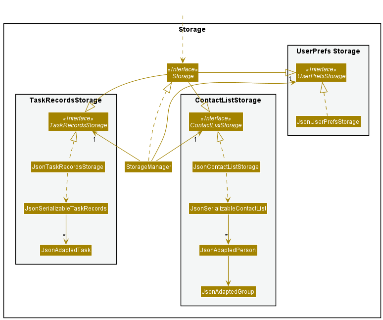

The Storage component,

* can save contact list/task records/user preference data in json format, and read them back into corresponding objects.
* inherits from `ContactListStorage`, `TaskRecordsStorage`, and `UserPrefStorage`, which means it can be treated as either one (if only the functionality of only one is needed).
* depends on some classes in the Model component (because the Storage component’s job is to save/retrieve objects that belong to the Model)

---

## **Implementation**

This section describes some noteworthy details on how certain features are implemented.

### Edit feature ( `edit` and `editTask` commands)
#### Implementation
The edit feature allows users to edit specific fields in tasks or contacts. The implementation for both contacts (`edit`) and
tasks (`editTask`) are similar. Therefore we can generalize the implementation of the edit feature by exploring how the `editTask` command works for tasks.
Given below is a sequence diagram of the execution of an edit command: [Click here for better resolution](https://ay2122s1-cs2103t-w12-2.github.io/tp/images/EditTaskSequenceDiagram.png)

The general logic of the `editTask` command is similar to `addTask` (which can be found above),
with the following differences:
1. editTask uses a `EditTaskDescriptor` to store the specified values that the user want to change
1. when EditTaskCommand is executed, we create a new task, where the value of each field is given more priority to the `EditTaskDescriptor` than the non-edited task. (i.e if a field is non-null in EditTaskDescriptor, the value of that field in the new task will be equal to that field in the `EditTaskDescriptor`. Else, it will remain unchanged from the old task)
1. we then replace this new task with the current task in the model

Given below is an example usage scenario of how a contact is edited:
1. The user enters the edit command with the specified fields to be edited.
   (e.g edit 1 n/Johm Doe tg/johndoeee))
1. SWEe-book updates the contact with the new updated fields, with non-updated fields left unchanged.

:information_source: **Note:** For `editTask` command, a date **must** be specified 
for **recurring** tasks and **deadline/event** tasks. Else, an error message will be shown to the user. (It does not make sense for a task that is recurring, or that is a deadline/event, to have no date!)

#### Alternative considerations
* Alternative 1: Update the fields of the old task, without creating a new task.
    * Pros: Less logic needed, less complexity. (No need for `EditTaskDescriptor` class)
    * Cons: Hard to debug, and more prone to errors, as we are mutating the object in the list

### Recurring Tasks feature
#### Implementation
The recurring task feature allows users to add tasks that can be repeated by week, month, or year. It is facilitated
by `RecurringFrequency`, which is a optional component of `Task`. Additionally, the following operations are implemented
in `Task`, `TaskList`, `TaskRecords` and `Date`:
* `Task#updateRecurringTaskDate()` - Task updates its Date to the current week/month/year, based on the
  recurringFrequency of the Task.
* `Date#isLastWeek()`, `Date#isLastMonth()`, `Date#isLastYear()` - Checks current Date of Task against real-time date.
* `Date#getDateForThisWeek()`, `Date#getDateForThisMonth()`, `Date#getDateForThisYear()` - Updates Date to be within
  current week/month/year.
* `TaskList#updateRecurringTasksDates()` - Iterates through list of Tasks and updates its Date if Task is recurring.
* `TaskRecords#updateRecurringTasks()` - Calls for TaskList to update recurring Tasks.

`TaskRecords#updateRecurringTasks()` is used in the `ModelManager` on boot-up of the application to update all Tasks, if
required. Below is a sequence diagram after the initialisation of the `ModelManager`:

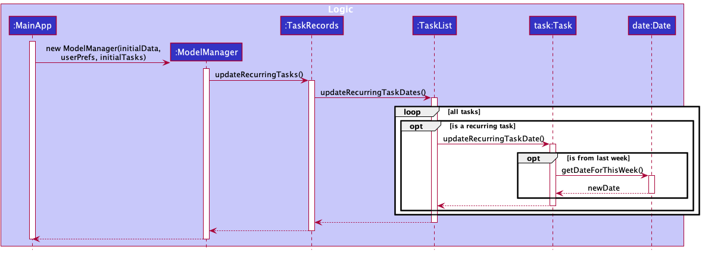

Do note that `Date` is required for a `Task` to be recurring. Notably, `Date` is optional for `Todo`.

Given below is an example usage scenario of how a recurring task is added and how it behaves upon re-launching of
the SWEe-book application.

* Step 1. The user launches the application. A recurring `Task` is added, where the user specifies the
  `recurringFrequency` to be weekly, and the `Date` to be from the previous week. The `Task` is added, but the `Date` is
  not updated yet, even if it is not of the current week. The `recurringFrequency` of the task is marked as `week`.
* Step 2. The user re-launches the application. `ModelManager` calls `TaskRecords#updateRecurringTasks()`, which then 
  calls `TaskList#updateRecurringTasksDates()`, which then calls `Task#updateRecurringTaskDate()` on the task added. 
  Since the `Task` added was recurring (its `recurringFrequency` is marked as `week`, its `Date` is updated to the 
  current week, with the same day.
* Step 3. The user then launches the application a week after. The `Task` is updated similarly to Step 2, and since it 
  is checked against real-time, it is updated to the current week.
  
Given below is an activity diagram when a user adds a recurring task and restarts his SWEe-book application.

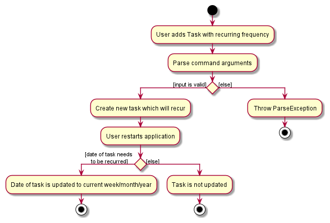

#### Alternative considerations
* Alternative 1: Let the user choose when to refresh his tasks to their new dates, rather than on start-up of the application.
    * Pros: Allows user more control over their recurring tasks
    * Cons: Less intuitive since tasks are not updated to real-time, having a refresh command just for recurring tasks 
      is not ideal.

### Sort Tasks Feature

The sort tasks feature allows users to sort the task list according to their needs. They can sort the tasks by their descriptions, groups, priorities and date. They can also choose whether they want the sorting be in ascending or descending order. This gives users 8 different ways to sort their tasks.

The following is the Activity Diagram for the sort tasks command.

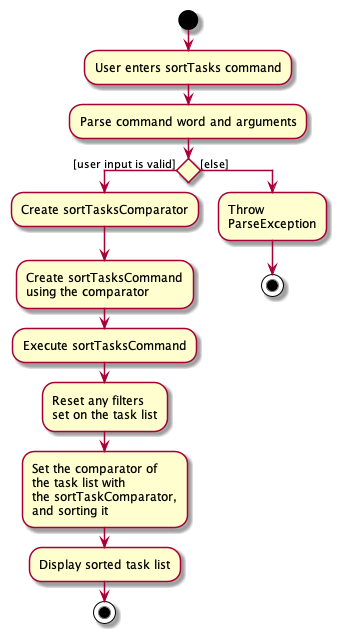

#### Implementation
The Sequence Diagram below illustrates the interactions between the `Logic` component and `Model` component for the `execute("sortTasks param/desc o/a")` API call. It also shows how it interacts with the `UI` Component through the illustration of the command's interaction with JavaFx's `ObservableLists` (`FilteredList` and `SortedList`).

The JavaFx package automatically detects any changes to the task list, implemented with JavaFX's `ObservableList`. This includes detecting changes in the comparators and filters applied on it. When the `SortTasksCommand` is executed, it removes any existing filters applied on the task list to reset the task list back to its original state before setting a comparator to it. The `FilterTasksCommand` works the same way as well by setting the `comparator` to `null` while setting the `predicate` to the appropriate predicate (filter).  

### Done Tasks Feature
#### Implementation
The doneTask feature allows users to mark a specific task as done.
Given below is a sequence diagram of the execution of a doneTask command: 
[Click here for better resolution](https://ay2122s1-cs2103t-w12-2.github.io/tp/images/DoneTaskSequenceDiagram.png)

Given below is an example usage scenario of how a task is marked as done:
Preconditions: Valid task index provided.
1. User keys in doneTask command with the specific index of task.
   (e.g. doneTask 1)
2. The first task in task list is marked as done.

:information_source: **Note:** If any of the guard clauses fail, 
i.e. the index given is negative or otherwise invalid, or the task has already been marked as done, an appropriate 
exception will be thrown and an appropriate error message will be shown to the user.
(It does not make sense to mark a task that has been done as done!)

The following activity diagram summarizes the actions taken when DoneTaskCommand is executed: 

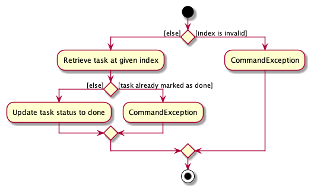

#### Alternative considerations
* Alternative 1 (current choice): Separate updating of a task's status into its own command
    * Pros: More streamlined command for ease of use
        * Our target user (CS2103T students) are likely to update task statuses a with must higher frequency than
      information like task description or task priority etc.
      Hence, having a dedicated command to update status of task streamlines the user workflow.
    * Cons: Additional command increases complexity, harder to maintain.
* Alternative 2: Integrate updating of task status into ‘editTask’ command
    * Pros: Fewer commands for user to remember as well as fewer commands for developers to maintain
    * Cons: More troublesome to when user just wants to update task status.
    

---
## **Documentation, logging, testing, configuration, dev-ops**

* [Documentation Guide](https://ay2122s1-cs2103t-w12-2.github.io/tp/Documentation.html)
* [Testing Guide](https://ay2122s1-cs2103t-w12-2.github.io/tp/Testing.html)
* [Logging Guide](https://ay2122s1-cs2103t-w12-2.github.io/tp/Logging.html)
* [Configuration Guide](https://ay2122s1-cs2103t-w12-2.github.io/tp/Configuration.html)
* [DevOps Guide](https://ay2122s1-cs2103t-w12-2.github.io/tp/DevOps.html)

---

## **Appendix: Requirements**

### Product scope

**Target user profile**:

* is a CS2103T/CS2101 student
* has a need to keep track of tasks pertaining to CS2103T/CS2101 module
* has a need to keep track his/her CS2103T/CS2101 group mates' contact details
* prefer desktop apps over other types
* can type fast
* prefers typing to mouse interactions
* is reasonably comfortable using CLI apps

**Value proposition**: Manage contacts of group mates and daily tasks faster than a typical mouse/GUI driven app

### User stories

Priorities: High (must have) - `* * *`, Medium (nice to have) - `* *`, Low (unlikely to have) - `*`

| Priority | As a …​                                 | I want to …​                     | So that I can…​                                                        |
| -------- | ------------------------------------------ | ------------------------------ | ---------------------------------------------------------------------- |
| `* * *`  | new user                                   | see usage instructions         | refer to instructions when I forget how to use the App                 |
| `* * *`  | user                                       | add a new person               |                                                                        |
| `* * *`  | user                                       | delete a person                | remove entries that I no longer need                                   |
| `* * *`  | user                                       | find a person by name          | locate details of persons without having to go through the entire list |
| `* *`    | user                                       | hide private contact details   | minimize chance of someone else seeing them by accident                |
| `*`      | user with many persons in the contact list | sort persons by name           | locate a person easily                                                 |
| `*`      | user                                       | Add a new task to the list | keep track of the tasks that needs to be done       |
| `* * *`  | new user                                   | Have an overview of my groupmate details like telegram, email and name.  | So I can easily contact them |
| `* * *`  | forgetful user                             | have a list of tasks           | follow up on it and not miss out tasks                   |
| `*`      | user                                       | delete a task in the list      | delete the tasks that are no longer needed               |
| `*`      | user                                       | mark a task in the list as done | keep track of which tasks are done or not yet done      |
| `* * *`  | long term user                             | quickly check deadlines in order of priority (sort) | clear the tasks due one at a time                 |
| `* * *`  | user                                       | filter the task according to the different modules | know what I can do for each module               |
| `* *` | user | edit specific fields in a task | conveniently change specific fields without needing to delete and add back a task

### Use cases

(For all use cases below, the **System** is the `SWEe-book`, **Actor** is the `user` while **person** can be used interchangeably with contact (as in contact list), unless specified otherwise)

**Use case (UC01): Add a person**

**MSS**

1. User adds a person
2. System shows the details of the person

    Use case ends.

**Extensions**

* 2a. The details are invalid or incomplete.
    * 2a1. System shows an error message.

      Use case resumes at step 2.

**Use case (UC02): Delete a person**

**MSS**

1. User requests to list persons
2. System shows a list of persons
3. User requests to delete a specific person in the list
4. System deletes the person

    Use case ends.

**Extensions**

* 2a. The list is empty.

  Use case ends.

* 3a. The given index is invalid.
    * 3a1. System shows an error message.

      Use case resumes at step 2.

**Use case (UC03): Edit a person's particulars**

**MSS**

1. User requests to list persons
2. System shows a list of persons
3. User requests to edit a specific person in the list
4. System shows the details of the updated person

    Use case ends.

**Extensions**

* 3a. The details are invalid or incomplete.
    * 3a1. System shows an error message.

      Use case resumes at step 3.

**Use case (UC04): Find a person / a group of people**

**MSS**

1. User requests to find a person / a group of people using some keywords
2. System shows a list of persons pertaining to the keywords

    Use case ends.

**Use case (UC05): Add a task**

**MSS**

1. User keys in a task.
2. System shows the details of the task added to task list. 

    Use case ends.

**Extensions**

* 2a. The task details are invalid or incomplete.
    * 2a1. System shows an error message about the incorrect or missing details.

  Use case ends.

**Use case (UC06): Edit a task**

**MSS**

1. User requests to edit a specific person in the list
1. System shows the details of the updated person

   Use case ends.

**Extensions**

* 1a. The details are invalid or incomplete.
    * 1a1. System shows an error message.

      Use case resumes at step 3.

**Use case (UC07): Delete a task**

1. User requests to list tasks.
2. System shows a list of tasks.
3. User keys in an index.
4. The task of specified index in task list is removed.

    Use case ends.

**Extensions**

* 1a. User keys in an invalid index.
    * 1a1. System displays an error message about invalid index.

        Use case ends.

**Use case (UC08): Have an overview of group mates' contact details**

1. User keys in a group of which its members' contact details are needed.
2. System displays the contact information of the group members of specified group

   Use case ends.

**Extensions**

* 1a. User keys in an invalid group.
    * 1a1. System displays an error message about invalid group.

        Use case ends.

**Use case (UC09): Have a list of tasks**

1. User keys in the command to list the tasks.
2. System displays the list of tasks.

    Use case ends.

**Extensions**

* 1a. User keys in an invalid command.
    * 1a1. System displays an error message about invalid command.

  Use case ends.

**Use case (UC10): Sort tasks**

1. User keys the command, the parameter and order which he wants the tasks to be sorted by.
2. System displays the tasks in the parameter and order specified.

    Use case ends.

**Extensions**

* 1a. User keys in an invalid parameter or order.
    * 1a1. System displays an error message about invalid parameter or order.

        Use case ends.

**Use case (UC11): Filter tasks**

1. User keys in a filter criterion.
2. System displays the tasks pertaining to the criterion specified.

    Use case ends.

**Extensions**

* 1a. User keys in an invalid criterion.
    * 1a1. System displays an error message about invalid criterion. Use case ends.

**Use case (UC12): Mark a task as done**

1. User requests to list tasks.
2. System shows a list of tasks.
3. User keys in an index.
4. The task of specified index in task list is marked as done.

  Use case ends.

**Extensions**

* 1a. User keys in an invalid index.
    * 1a1. System displays an error message about invalid index.

  Use case ends.

### Non-Functional Requirements

1. Should work on any _mainstream OS_ as long as it has Java `11` or above installed.
2. Should be able to hold up to 1000 persons without a noticeable sluggishness in performance for typical usage.
3. A user with above average typing speed for regular English text (i.e. not code, not system admin commands) should be able to accomplish most of the tasks faster using commands than using the mouse.
4. System should respond within three seconds.
5. System still works even if the data file is missing.
6. If the data file is corrupted, the corrupted file is overwritten with an empty data file.
7. System will not collect any information from the user to abide by the Personal Data Protection Act.

### Glossary

| **Term** | **Meaning** |
| ---- | --------|
|**Mainstream OS**| Windows, Linux, Unix, OS-X |
|**Private contact detail**| A contact detail that is not meant to be shared with others|
|**CLI**|Command-Line Interface|
|**Group**| a group of either CS2103T or CS2101 students|
|**Index**| the ordering of task in the task list|

## **Appendix: Instructions for manual testing**

Given below are instructions to test the app manually.
* Note: These instructions only provide a starting point for testers to work on; testers are expected to do more
  exploratory testing.
* Note that only refactored or new features from AB3 are shown here.

### Adding a Contact

1. Prerequisites: No existing contact with the same...
    1. Name of `John Doe`, ignoring case-sensitivity and whitespaces between first/middle/last names (i.e "john doe" and "john &nbsp; &nbsp;doe" are the same as "John Doe")
    1. Email of `johnd@example.com`
    1. Telegram and GitHub usernames of `johndoe`
    
1. Testcase 1: `add n/John Doe g/CS2103T g/CS2101 p/98765432 e/johnd@example.com tg/johndoe gh/johndoe`
   
   Expected: Command result box shows the person is added with the correct fields specified. The added person should appear as the last person of the contact list in the GUI.

1. Testcase 2: `add n/Jane Doe g/CS2103T g/CS2101 p/98765432 e/janed@example.com tg/janedoe gh/janedoe`

   Expected: Unable to add person due to duplicate phone number. Command result box shows `A person with this phone number (98765432) already exists in the contact list.`

1. Other similar testcases: Trying to add any person which does not meet the prerequisites

   Expected: Unable to add person due to the duplicated field. Command result box shows `A person with this <duplicated field> (<duplicated field value>) already exists in the contact list.`

### Editing a contact

1. Prerequisites:
    1. There are at least 1 contact in the list

1. Testcase 1: `edit 1 tg/@newusername gh/newusername`
    
    Expected: Edits the usernames of first contact in the list to the new usernames.

1. Testcase 2: `edit 1 p/91234567`

    Expected: Edits the phone number of first contact in the list to the new phone number.

### Filtering contacts by group
1. Testcase 1: `group CS2101`

   Expected: Contact list returns the list of people in the group `CS2101`.
1. Testcase 2: `group CS2103T`

   Expected: Contact list returns the list of people in the group `CS2103T`.
1. Testcase 3: `group CS1111`

   Expected: Error message shown due to invalid group name.

### Editing a task
1. Prerequisites:
    1. For each testcase, please use the following task by using the addTask command: `addTask d/finish coding g/CS2101 type/todo`
    1. Assume that the task list only contains the above task.

1. Testcase 1: `editTask 1 type/event`
   
   Expected: Error message shown as an event needs to have an associated date.

1. Testcase 2: `editTask 1 type/event date/2021-11-11`

   Expected: Edits the first task in the list with the correct updated fields. Command result shows edited task fields, and GUI updates the corresponding fields of the task.

1. Testcase 3: `editTask 1 recurring/week`
   
   Expected: Edits the first task in the list with the correct updated fields. Command result shows edited task fields, and GUI updates the corresponding fields of the task.

### Sorting task lists

1. Sorting task list with valid parameter and order
   1. Prerequisites: The task list is from the sample task list data that comes with the jar file is first run.
   2. Test case: `sortTasks param/desc o/a`   Expected task list (sorted by description in ascending order lexicographically):
      1. Create slides
      2. OP1 Presentation
      3. OP1 script
      4. Project Meeting
      5. Update User Guide

   3. Test case: `sortTasks param/date o/d`   Expected task list (sorted by date in reverse chronological order)
      1. Project Meeting (Dec 21 2021)
      2. Update User Guide (Dec 11 2021)
      3. OP1 Presentation (Nov 21 2021)
      4. Create slides (Nov 17 2021)
      5. OP1 script (Nov 11 2021)

2. Sorting task list with invalid parameter, order or both
   1. Prerequisites: The task list is from the default task list data that comes with the jar file.
   2. Test case: `sortTasks param/tasktype o/a`   Task list does not change and SWEe-book returns an error message with its correct usage.
   3. Test case: `sortTasks param/date o/c`   Task list does not change and SWEe-book returns an error message with its correct usage.

### Filtering task lists

1. Filtering task list with a valid criterion
    1. Prerequisites: The task list is from the sample task list data that comes with the jar file is first run.
    2. Test case: `filterTasks date/2021-11-11`   Expected task list (filtered by date of 11 Nov 2021):
        1. OP1 script
    3. Test case: `filterTasks g/CS2103T`   Expected task list (filtered by group of CS2103T):
        1. Update User Guide
        2. Project Meeting

2. Filtering task list with an invalid criterion
    1. Prerequisites: The task list is from the sample task list data that comes with the jar file is first run.
    2. Test case: `filterTasks pty/1`   Task list does not change and SWEe-book returns an error message with its correct usage.
    3. Test case: `filterTasks g/CS2107`   Task list does not change and SWEe-book returns an error message with its correct usage.

### Marking a task as done

1. Marking a task's status as done successfully
    1. Prerequisites: There is at least one task in task list. List all tasks using the `listTasks` command. 
       Assume there is a task `Project Meeting` that is not done at index 1 of task list.

    2. Test case: `doneTask 1`
       Expected: Task `Project Meeting` status is updated to done.
       A success message, with details of task that is marked as done, is shown.

2. Attempting to mark a task as done with invalid index
    1. Prerequisites: List all tasks using the `listTasks`. Assume there are a total of 4 tasks.

    2. Test case: `doneTask 6`
       Expected: An error message is shown, indicating that given index exceeded total number of tasks.

    3. Test case: `doneTask -1`
       Expected: An error message is shown, indicating that index should not be negative.

3. Attempting to mark a task, that is already done, as done
    1. Prerequisites: List all tasks using the `listTasks`. Assume there is a task `Project Meeting` 
       that has been marked as done at index 1 of task list.

    2. Test case: `doneTask 1`
       Expected: An error message is shown, indicating that task has already been marked as done.

### Adding a task

1. Adding a task with all fields
    1. Test case: `addTask d/Project Meeting g/CS2101 type/Todo date/2021-11-11 pty/low recurring/week`
       Expected: Task with all the above fields added to the task list. Task list in GUI is updated with this new task,
       added to the bottom of the list
    2. For incorrect addTask commands, try: `addTask d/<any description> g/<not CS2101 or CS2103T> <other valid params>`,
       `addTask <other valid params> type/<not Todo, Event or Deadline> <other valid params>`,
       `addTask <other valid params> pty/<not low, med or high> <other valid params>`,
       `addTask <other valid params> recurring/<not week, month, or year>`

    2. Adding a task without optional fields
       1. Test case: `addTask d/Assignment g/CS2103T type/Todo`
          Expected: Task with all the above fields added to the task list. Task list in GUI is updated with this new task,
          added to the bottom of the list
       2. Test case: `addTask d/Assignment g/CS2103T type/Event`
          Expected: No task is added and error is shown. Event type task must have a date attached, date is not optional for
          events. 
       3. Test case: `addTask d/Assignment g/CS2103T type/Event`
          Expected: No task is added and error is shown. Deadline type task must have a date attached, date is not optional
          for deadlines. 
       4. Test case: `addTask d/Rehearsal g/CS2101 type/Todo recurring/month`
          Expected: No task is added and error is shown. Task with recurring field must have a date as well.

### Listing all tasks

1. List all tasks
    1. Prerequisite: Have some tasks saved in `[JAR file location]/data/taskrecords.json`
    2. Test case: `listTasks`
       Expected: Task list in GUI is updated to show all saved tasks.

### Deleting a task
1. Deleting a task from SWEe-book
    1. Prerequisites: There are 2 tasks in task list. List all tasks using the `listTasks` command.
       At index `1` we have `Project Meeting`, and at index `2` we have `Presentation`

    2. Test case: `deleteTask 1` 
       Expected: Task `Project Meeting` is deleted and removed from task list.
       A success message with details of the deleted task is shown.

    3. Test case: `deleteTask 3` 
       Expected: An error message is shown, indicating that given index exceeded total number of tasks.

    4. Test case: `deleteTask -3` 
       Expected: An error message is shown, indicating that index should not be negative.

## **Appendix: Effort**

### Adding new UI components
* After V1.2, our team had yet to modify the existing AB3 UI , despite already implementing one of the main components of SWEe-book, namely task management, and made some adjustments to the existing contact list component. We encountered some difficulties in reflecting task list in the UI, and also modifying it with features such as FilterTasks and SortTasks, and thus at that time most of the task management is still reflected on the CLI only. Fortunately, our group managed to make use of Java SortedList and FilteredList to help us implement the task management UI component.

### Implementing dynamic features
* SWEe-book features implemented require the user to type in commands in the CLI to be executed. As our group implemented more features which allow for more variations and contextualization, such as task priority, we realized that this may be too troublesome for a part of our target audience as they may have to type relatively long commands, especially for task management. Thus, to minimize this, we decided to make some feature fields optional. This means that when the user does not specify the field, it will be set to a default value. For example, when task priority is not specified, it will be automatically set to a default value of “medium”. We believe that this will make SWEe-book more convenient to use as our target audience do not need to type too long of a command, while still being given the option to specify more details.

### Showing warnings when the data file is invalid or empty
* When the app starts up, it will load the data from the respective data files (.json files). When an error occurs, it is difficult to display an error message onto the Ui as it would break the current design pattern where a message will only appear through a user-input command from the class CommandResult. Loading from the storage files should not go through a series command. However, It is also not good to not inform the users about the error and just simply give an empty contact list or task list. To counter that, we just simply make the Ui pop-up a new window to inform the users about the error, whether the data files are missing or corrupted.

## Acknowledgement

### Code reuse

1. The following code is reused from [here](https://github.com/regexhq/regex-username/blob/master/index.js). The code is used to check if usernames are valid via regex.
   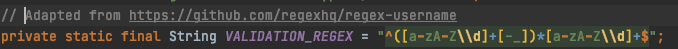
1. The following code is reused from [here](https://stackoverflow.com/a/5226244). The code is used to enable users to launch hyperlinks in their default browser by clicking on them in the GUI.
   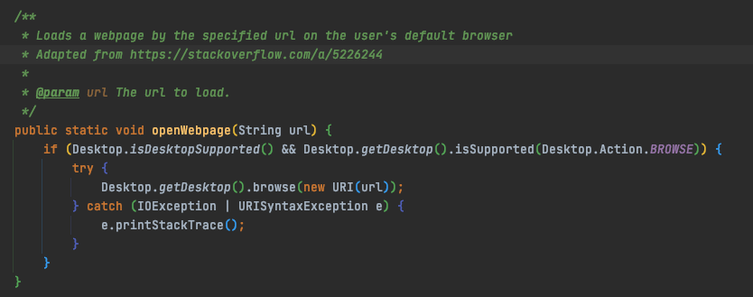

### Documentation and diagrams

A large part of the documentation and diagrams are reused from the AddressBook-Level3 project created by the [SE-EDU initiative](https://se-education.org).
