SWEe-book is a **desktop app for CS2103T/CS2101 Computer Science students to manage contacts and tasks 
pertaining to CS2103T/CS2101 module, optimized for use via a Command Line Interface** (CLI). This means that you can operate 
the application by typing commands into a Command Box. If you can type fast, SWEe-book can get your contact management and 
task management done faster than traditional Graphical User Interface (GUI) applications, 
which allows users to interact with the application through graphical icons such as buttons. 

SWEe-book offers **one-stop integration solution to managing tasks and contacts in your CS2103T or CS2101 group.**

* Table of Contents
{:toc}

--------------------------------------------------------------------------------------------------------------------

## Glossary

* **GUI** is short-form for Graphical User Interface, which refers to what the user sees as a graphic. In SWEe-book, the GUI  
  refers to the contact and task lists as shown in the red box below.  

  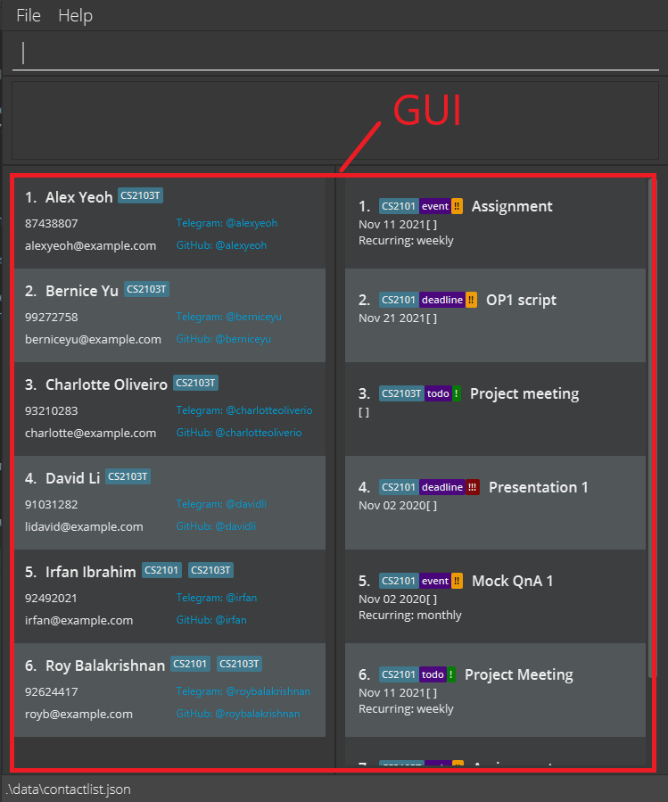

* **CLI** is short-form for Command Line Interface, it is what the user types commands into to query or add information into  
  SWEe-book. It refers to the box at the top which users types into (also known as the command box) and the box directly  
  below it which shows feedback based on what command was typed. They are shown in the coloured boxes below.  

  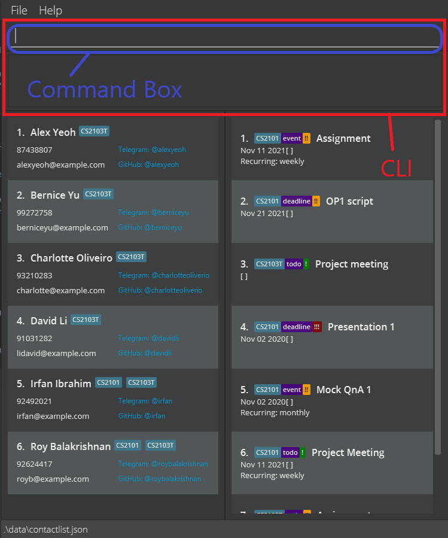

* **Commands** are what the user types into the command box. They consist of the command keyword (eg. `add`, `find`, `addTask`)  
  and the parameters to the command. Explanation of parameters is shown below.

* **Parameters** are the terms that the user types after the command keyword to narrow the scope of their query. There can   
  any number of parameters to a command, even 0, depending on the command.   
  An example of parameters is in the command  
  format `add n/NAME g/GROUP1 [g/GROUP2] p/PHONE_NUMBER e/EMAIL tg/TELEGRAM_USERNAME gh/GITHUB_USERNAME`,   
  (`n/NAME`, `g/GROUP1`, `[g/GROUP2]`, `p/PHONE_NUMBER`, `e/EMAIL`, `tg/TELEGRAM_USERNAME`, `gh/GITHUB_USERNAME`) are all  
  parameters. Do note parameters in square brackets (`[g/GROUP2]`) are optional.

* Do note that any highlighted words (e.g. `add`) in this User Guide refers to words that can be typed into the   
  command box, or items that will show up in the GUI as a result.

* **Lexicographical order** is an order similar to alphabetical order, but more relevant to programming. Just like how "a, b, c" is in alphabetical order, "0, 1, A, b a, b" is in lexicographical order. Notice how the numbers come before upper case letters, which in turn come before lower case letters.

* A **task** can be a todo task, deadline task, or an event task. A  todo is a task that can be date-less (e.g. buy stationary) while a deadline task and an event task must be accompanied by a date parameter.

* An **index** refers to the index number or the position of the contact or task in the contact list or in the task list respectively. This is similar to the "No." column in a table. The first contact in the contact list will have an index of 1.

* An **integer** is a mathematical term which means whole number (without any decimals). 4, 52 and -10 are integers while 2.5, 9.8 and -0.2 are not.

--------------------------------------------------------------------------------------------------------------------

## Quick start

1. Ensure you have Java `11` or above installed in your Computer.

1. Download the latest `SWEe-book.jar` from [here](https://github.com/AY2122S1-CS2103T-W12-2/tp/releases).

1. Copy the file to the folder you want to use as the _home folder_ for your SWEe-book.

1. Double-click the file to start the app. The GUI similar to the below should appear in a few seconds. Note how the app contains some sample data. 
   

1. Type the command in the command box and press Enter to execute it. e.g. typing **`help`** and pressing Enter will open the help window. 
   Some example commands you can try:

  * **`list`** : Lists all contacts.

  * **`add`**`n/John Doe g/CS2103T p/98765432 e/johnd@example.com tg/johndoe gh/johndoe` : Adds a contact named `John Doe` to the SWEe-book.

  * **`listTasks`** : Lists all tasks.

  * **`deleteTask`**`1` : Deletes the first task shown in the current task list.

  * **`exit`** : Exits the app.

1. Refer to the [Features](#features) below for details of each command.

**:bulb: Tip:**
 
* If you are unsure about where the contact list, task list or command input box are, check out the [Ui Design](#ui-design) section.

--------------------------------------------------------------------------------------------------------------------

## UI Design

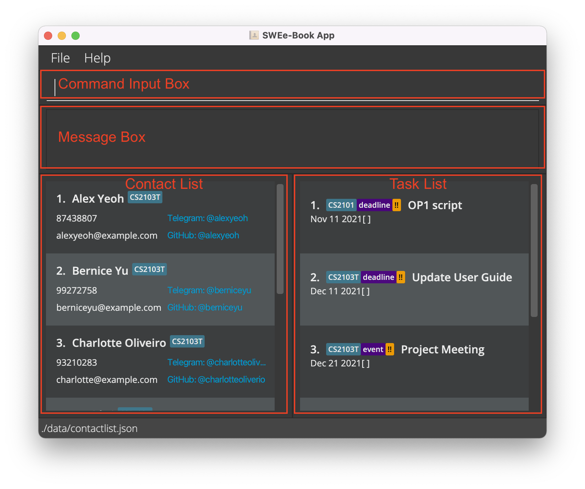
 
* **Command Input Box**: Type your commands here!

* **Message Box**: Displays the details of the result of your commands or error messages.

* **Contact List**: Displays your list of group mates and their relevant information.

* **Task List**: Displays your tasks.

--------------------------------------------------------------------------------------------------------------------

## Features

**:information_source: Clarifications for common terms used in this User Guide:** 

* **GUI** is short-form for Graphical User Interface, which refers to what the user sees as a graphic. In SWEe-book, the GUI refers to the contact and task lists as shown in the red box below.  
  

* **CLI** is short-form for Command Line Interface, it is what the user types commands into to query or add information into SWEe-book. It refers to the box at the top which users type into (also known as the command box) and the box directly below it which shows feedback based on what command was typed. They are shown in the coloured boxes below.  
  

* **Tasks** are items which you would like to keep track of with a description attached to them. The task list is displayed on the right side of the GUI.

* **Contacts** are items which signify persons who you would like to keep a contact of. The contact list displayed on the left side of the GUI.

* **Commands** are what the user types into the command box. They consist of the command keyword (eg. `add`, `find`, `addTask`)and the parameters to the command. Explanation of parameters is shown below.

* **Parameters** are the terms that the user types after the command keyword to narrow the scope of their query. There can any number of parameters to a command, even 0, depending on the command.
  An example of parameters is in the command format `add n/NAME g/GROUP1 [g/GROUP2] p/PHONE_NUMBER e/EMAIL tg/TELEGRAM_USERNAME gh/GITHUB_USERNAME`,(`n/NAME`, `g/GROUP1`, `[g/GROUP2]`, `p/PHONE_NUMBER`, `e/EMAIL`, `tg/TELEGRAM_USERNAME`, `gh/GITHUB_USERNAME`) are all parameters. Do note parameters in square brackets (`[g/GROUP2]`) are optional.

* Do note that any highlighted words (eg. `add`) in this User Guide refers to words that can be typed into the command box, or items that will show up in the GUI as a result.  

* **INDEX** refers to a number which corresponds to a task's/contact's position in the tasklist/contact list. (eg. INDEX 1 means it's the first task on the task list)

### General Features

#### Viewing help : `help`

Shows a window that allows you to copy the website link to access the user guide in cases when error messages are still insufficient.

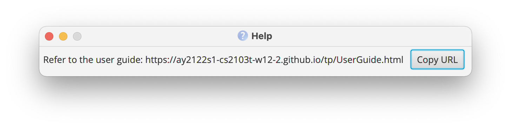

Format: `help`

#### Exiting the program : `exit`

Exits the program.

Format: `exit`

#### Editing the data file

SWEe-book contacts data are saved as a JSON file `[JAR file location]/data/contactlist.json`, whereas tasks management data are saved as `[JAR file location]/data/taskrecords.json`. Advanced users are welcome to update data directly by editing the data files.

:exclamation: **Caution:**
If your changes to the data file makes its format invalid, SWEe-book will discard all data and start with an empty data file at the next run.

#### Saving the data

SWEe-book data are saved in the hard disk automatically after any command that changes the data. You do not need to save manually.

### Contact Management Features

#### Adding a person: `add`

Adds a person to SWEe-book.

Format: `add n/NAME g/GROUP1 [g/GROUP2] p/PHONE_NUMBER e/EMAIL tg/TELEGRAM_USERNAME gh/GITHUB_USERNAME`

:bulb: **Tip:**
You can optionally prepend usernames with '@'. SWEe-book takes care of it!
(i.e. `@johndoe` and `johndoe` are equivalent as they will both be parsed into the username `johndoe`)

Examples:
* `add n/John Doe g/CS2103T p/98765432 e/johnd@example.com tg/@johndoe gh/johndoe`
  * Adds a contact with name `John Doe`, group `CS2103T`, phone number `98765432`, email `johnd@example.com`, telegram username `johndoe`, github username `johndoe`
* `add n/Betsy Crowe p/92221234 g/CS2103T g/CS2101 e/betsycrowe@example.com tg/betsyyy gh/crowebetsy`
    * Adds a contact with name `Betsy Crowe`, group `CS2103T` **and** `CS2101`, phone number `92221234 `, email `betsycrowe@example.com`, telegram username `betsyyy`, github username `crowebetsy`

#### Listing all persons : `list`

Shows a list of all persons in SWEe-book.

Format: `list`

#### Locating persons by name: `find`

Finds persons whose names contain any of the given keywords.

Format: `find KEYWORD [MORE_KEYWORDS]`

* The search is case-**in**sensitive. e.g. `hans` will match `Hans`
* The order of the keywords does not matter. e.g. `Hans Bo` will match `Bo Hans`
* Only the name is searched.
* Only full words will be matched e.g. `Han` will not match `Hans`
* Persons matching at least one keyword will be returned (i.e. `OR` search).
  e.g. `Hans Bo` will return `Hans Gruber`, `Bo Yang`

Examples:
* `find alex` 
  * Returns `Alex Yeoh`
  
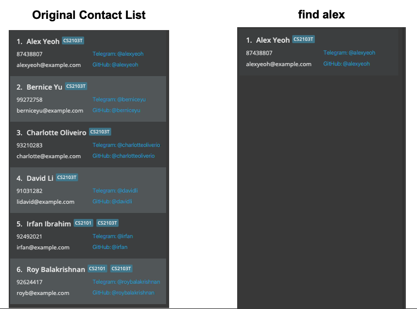

* `find alex david`
  * Returns `Alex Yeoh`, `David Li` 

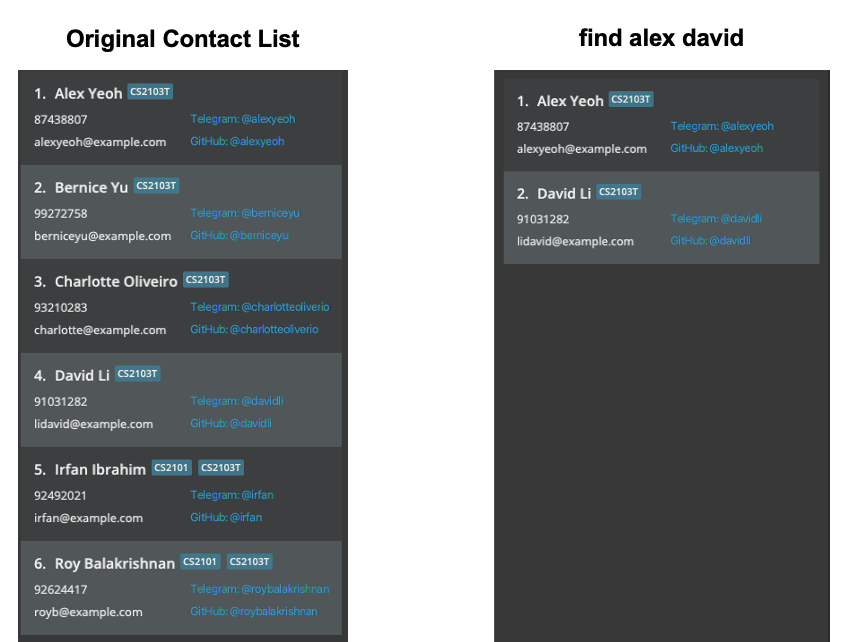
  
#### Editing a person : `edit`

Edits an existing person in SWEe-book.

Format: `edit INDEX [n/NAME] [g/GROUP1] [g/GROUP2] [p/PHONE] [e/EMAIL] [tg/TELEGRAM] [gh/GITHUB]`

* Edits the person at the specified `INDEX`. The index refers to the index number shown in the displayed person list. The index **must be a positive integer** 1, 2, 3, …​
* At least one of the optional fields must be provided.
* Existing values will be updated to the input values.

Examples:
* `edit 1 p/91234567 e/johndoe@example.com` 
  * Edits the phone number and email address of the 1st person to be `91234567` and `johndoe@example.com` respectively.

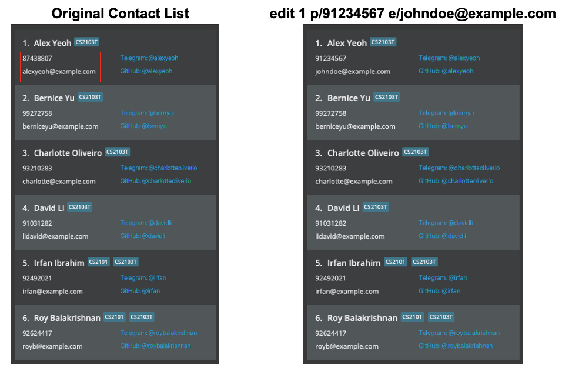

* `find Bernice` followed by `edit 1 tg/bernyu gh/bernyu` 
  * Edits the telegram and github usernames of the 1st person in the results of the `find` command.

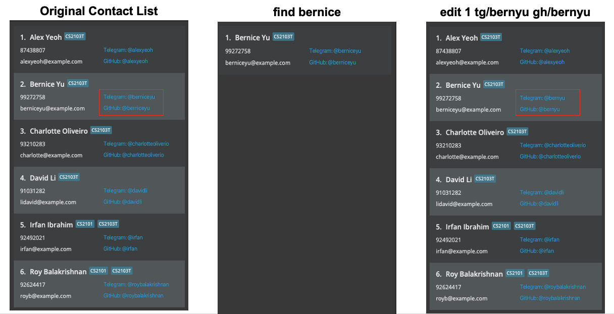

#### Deleting a person : `delete`

Deletes the specified person from SWEe-book.

Format: `delete INDEX`

* Deletes the person at the specified `INDEX`.
* The index refers to the index number shown in the displayed person list.
* The index **must be a positive integer** 1, 2, 3, …​

Examples:
* `list` followed by `delete 2`
  * Deletes the 2nd person in SWEe-book.
* `find Betsy` followed by `delete 1`
  * Deletes the 1st person in the results of the `find` command.

#### Filtering persons by a specified group: `group`
Retrieves the list of people that are in the specified group.

Format: `group GROUP_NAME`
* `GROUP_NAME` refers to one of the 2 groups: CS2101 or CS2103T.
* `GROUP_NAME` is case-**in**sensitive.
* Note that this is not a strict filter (i.e `group CS2103T` can return a person who is from both CS2103T **and** CS2101 groups)

Examples:
* `group CS2101`
  * Returns people in CS2101

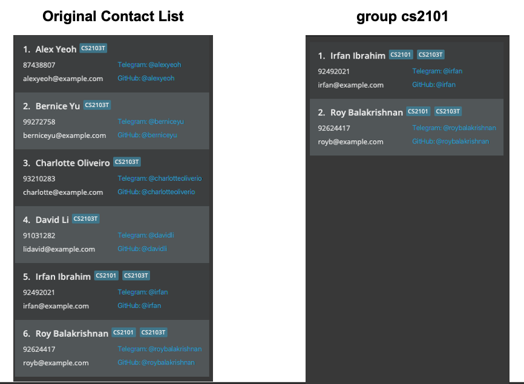

* `group CS2103T` 
  * Returns people in CS2103T

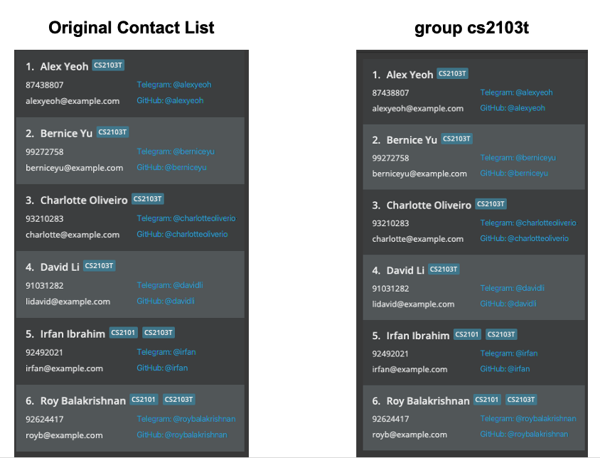

#### Clearing all contact entries : `clear`

Clears all contact entries from SWEe-book.

Format: `clear`

### Task Management Features

#### Adding a Task : `addTask`

Adds a new task to SWEe-book.

Format: `addTask d/DESCRIPTION g/GROUP type/TYPE [date/DATE] [pty/PRIORITY] [recurring/RECURRING_FREQUENCY]`
* `GROUP` refers to one of the 2 groups: `CS2101` or `CS2103T`
* `TYPE` refers to one of the 3 types of tasks: `todo`, `event` or `deadline`
* `DATE` is in YYYY-MM-DD format and is only needed for events or deadlines (i.e. `DATE` is optional for Todo tasks)
* `PRIORITY` refers to one of the 3 levels of priorities / importance of the task: `low`, `med` (default) or `high`
* `RECURRING_FREQUENCY` refers to one of the 3 different frequencies that the task could occur: `week`, `month` or `year` (where `week` means that the task is recurring weekly)
    * Any Task that has a recurring frequency must have a date as well, for example a Todo with recurring frequency must have a date.

Examples:
* `addTask d/Project meeting g/CS2103T type/todo pty/low`
  * Add a non-recurring `todo` with no date and `low` priority and
    task description `Project meeting` to the group `CS2103T`

* `addTask d/Presentation 1 g/CS2101 type/deadline date/2020-11-02 pty/high`
  * Add a non-recurring `deadline` due on `2020-11-02`
    with `high` priority and task description `Presentation 1`to the group `CS2101`

* `addTask d/Mock QnA 1 g/CS2101 type/event date/2020-10-02 recurring/month`
  * Add a `event` that recurs every `month` with
    date `2020-10-02` and default `med` priority and task description `Mock QnA` to the group `CS2101`
  

#### Editing a task: `editTask`

Edits an existing task in the task list.

Format: `editTask INDEX [d/DESCRIPTION] [g/GROUP] [type/TYPE] [date/DATE] [pty/PRIORITY] [recurring/RECURRING_FREQUENCY]`
* Edits the task at the specified `INDEX`. The index refers to the index number shown in the displayed task list. The index **must be a positive integer** 1, 2, 3, ...
* At least one of the optional fields must be provided.
* Existing values will be updated to the input values.
* To set a recurring task to be non-recurring, you can specify `recurring/none` as one of the arguments.

:bulb: **Tip:**
Please specify a date if you are changing a todo with no associated date into a deadline/event or recurring task!

Examples:
* `editTask 1 d/OP2 rehearsal g/CS2101 type/Event date/2021-11-11`
  * Edits the description, group, type of task, date of the first task in the task list to be
    `OP2 rehearsal`, `CS2101`, `Event` and`2021-11-11` respectively.
    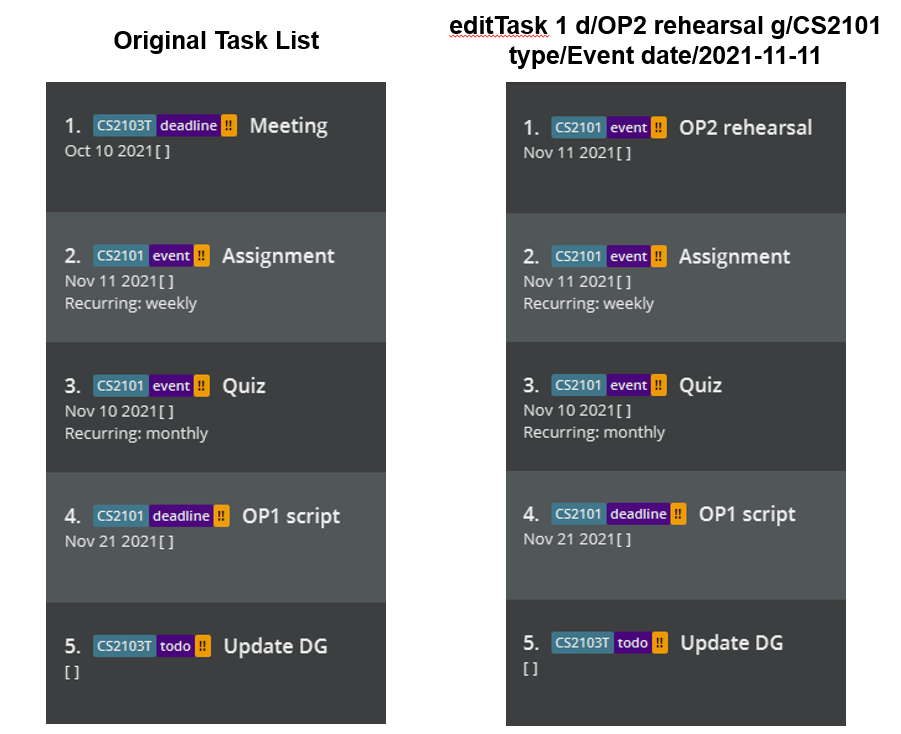

#### Deleting a task: `deleteTask`

Format: `deleteTask INDEX`

Deletes the task at the specified `INDEX`.
* The index refers to the index number shown in the displayed task list.
* The index **must be a positive integer** 1, 2, 3, …

Examples:
* `deleteTask 1` 
  * Deletes the 1st task in the task list.

#### Marking a task as done: `doneTask`

Format: `doneTask INDEX`

Marks the task at the specified `INDEX` as done.
* The index refers to the index number shown in the displayed task list.
* The index **must be a positive integer** 1, 2, 3, …
* The task must not have been marked as done before.

Examples:
* `doneTask 1` 
  * Marks the 1st task in the task list as done.

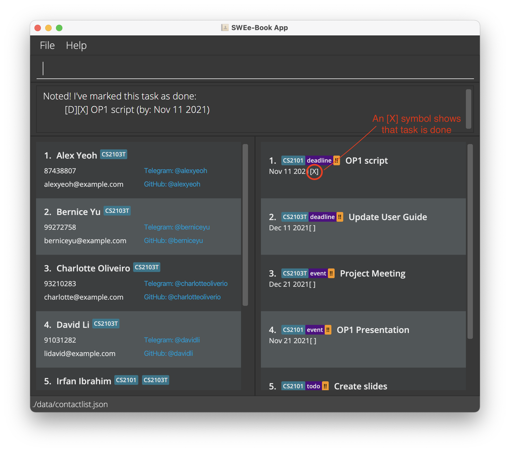

#### Sorting tasks: `sortTasks`
Sort tasks based on their descriptions, groups, priorities or deadlines / event dates.

Format: `sortTasks param/PARAMETER o/ORDER`
* The sort is case-**in**sensitive. e.g. CS2103T will be lexicographically identical to cs2103t, but cs2101 still comes before CS2103T.
* `PARAMETER` includes `desc` (for description), `date` (for a deadline / date of event), `pty` (for priority) and `group`.
* `ORDER` includes `a` for ascending order (0-9 and A-Z, oldest to newest, lowest to highest priority) and `d` for descending order(Z-A and 9-0, newest to oldest, highest to lowest priority)
* When the tasks are sorted by `date`, date-less `Todo` tasks will always be at the bottom of the list.

Examples:
* `sortTasks param/pty o/a` 
  * Sorts the task list by priority, with the low-priority tasks at the top and high-priority tasks at the bottom
* `sortTasks param/group o/a` 
  * Sorts the task list by group, with CS2101 tasks at the top and CS2103T tasks at the bottom
* `sortTasks param/desc o/d` 
  * Sorts the task list by description, with the tasks that has description which starts with "Z" at the top, then "Y", and so on.
* `sortTasks param/date o/a` 
  * Sorts the task list in chronological order (in terms of their deadlines / event dates)
* `sortTasks param/date o/d`
  * Sorts the task list in reverse chronological order (in terms of their deadlines / event dates)

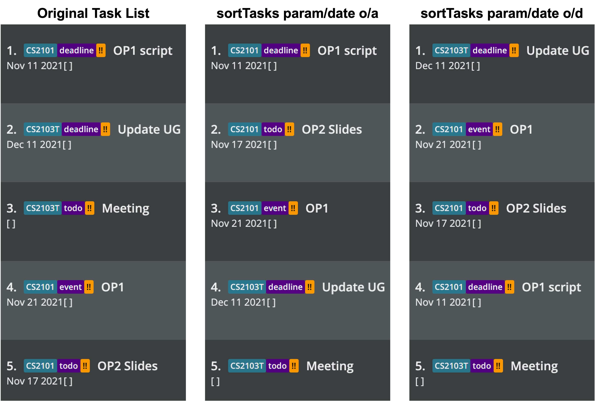

#### Filtering tasks by modules: `filterTasks`
Filter tasks based on a criterion

Format: `filterTasks FILTER_CRITERION`
* Filters the task by the specified `FILTER_CRITERION`
* `FILTER_CRITERION` refers to either `g/GROUP`, `date/DATE`, `type/TASKTYPE`, `d/DESCRIPTION` or `pty/PRIORITY`
* FilterTasks only accepts 1 `FILTER_CRITERION` and not more.
* Tasks corresponding to the criterion specified will be shown

Examples:
* `filterTasks g/CS2101`
  * Shows all the tasks related to CS2101 group
* `filterTasks date/2021-11-21`
  * Shows all the tasks with the date of 21 Nov 2021

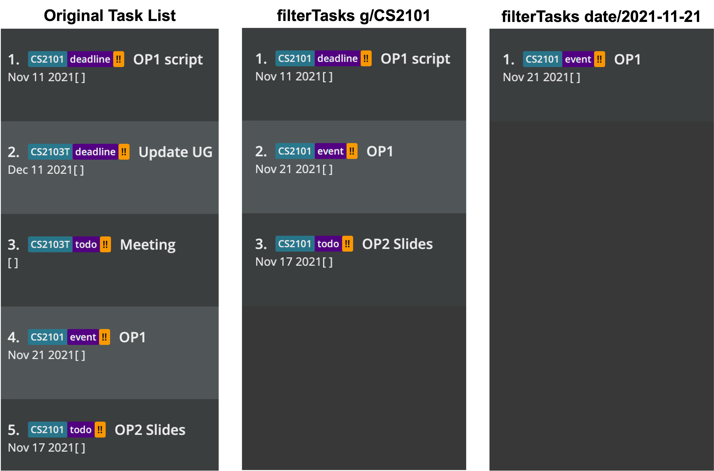

#### Listing all tasks: `listTasks`
Shows a list of all tasks in SWEe-book.

Format: `listTasks`
* Lists all tasks, resetting any sorting and filtering done by you previously

Examples:
* `listTasks`
  * Displays all tasks in right half of the GUI

--------------------------------------------------------------------------------------------------------------------

## FAQ

**Q**: How do I transfer my data to another Computer? 
**A**: You can install the app in the other computer and overwrite the empty data file it creates with the file that contains the data of your previous SWEe-book home folder.

**Q**: How do I install Java 11 on my computer? 
**A**: You can install Java 11 by downloading it [here](https://www.oracle.com/sg/java/technologies/javase/jdk11-archive-downloads.html). 

**Q**: How can I ensure that Java 11 has been installed on my computer? 
**A**: Open up your terminal and key in `java --version`. You can then see the java version that has been installed. An output of "java 11" means that java 11 has been successfully installed.

**Q**: Can I sync my contacts and tasks with other devices? 
**A**: Unfortunately, you cannot sync them at the moment. However, please look out for future updates.

--------------------------------------------------------------------------------------------------------------------

## Command summary
Here, you can view the summary of general, contact management, and task management commands.

### General Commands

Action | Format, Examples
--------|------------------
**Help** | `help`
**Exit** | `exit`

### Contact Management Commands

Action | Format, Examples
--------|------------------
**Add** | `add n/NAME g/GROUP1 [g/GROUP2] p/PHONE_NUMBER e/EMAIL tg/TELEGRAM_USERNAME gh/GITHUB_USERNAME`   e.g., `add n/John Doe g/CS2103T p/98765432 e/johnd@example.com tg/@johndoe gh/johndoe`
**Clear** | `clear`
**Delete** | `delete INDEX`  e.g., `delete 3`
**Edit** | `edit INDEX [n/NAME] [g/GROUP1] [g/GROUP2] [p/PHONE] [e/EMAIL] [tg/TELEGRAM] [gh/GITHUB]`  e.g.,`edit 2 n/James Lee e/jameslee@example.com`
**Find** | `find KEYWORD [MORE_KEYWORDS]`  e.g., `find James Jake`
**Group** | `group GROUP`   e.g., `group CS2103T`
**List** | `list`

### Task Management Commands

Action | Format, Examples
--------|------------------
**Add Task** | `addTask d/DESCRIPTION g/GROUP type/TYPE [date/DATE] [pty/PRIORITY] [recurring/RECURRING_FREQUENCY]`   (do note that `DATE` is only optional for `Todo` tasks)
**Edit Task** | `editTask INDEX [d/DESCRIPTION] [g/GROUP] [type/TYPE] [date/DATE] [pty/PRIORITY] [recurring/RECURRING_FREQUENCY]`
**Delete Task** | `deleteTask INDEX`
**Done Task** | `doneTask INDEX`
**Sort Tasks** | `sortTasks p/PARAMETER o/ORDER`   e.g., `sortTasks p/desc o/1`
**Filter Tasks** | `filterTasks FILTER_CRITERION`   e.g., `filterTasks g/CS2101`
**List Tasks** | `listTasks`
