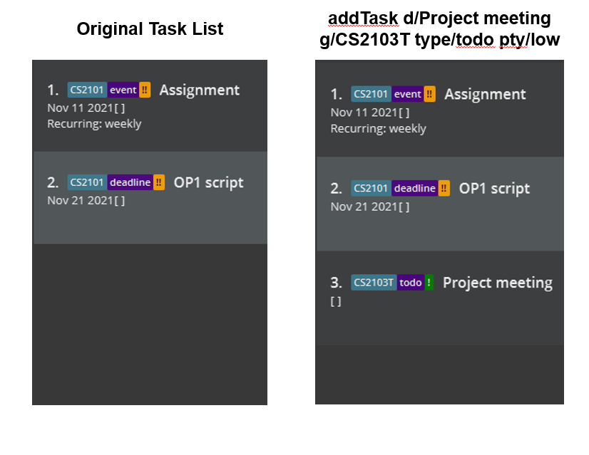
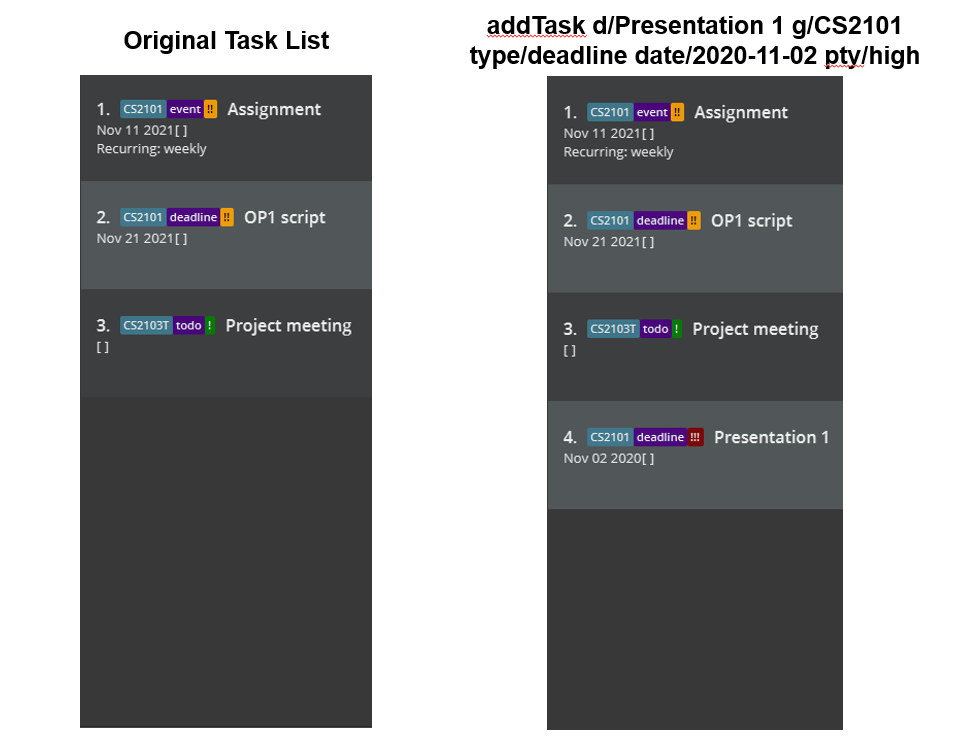
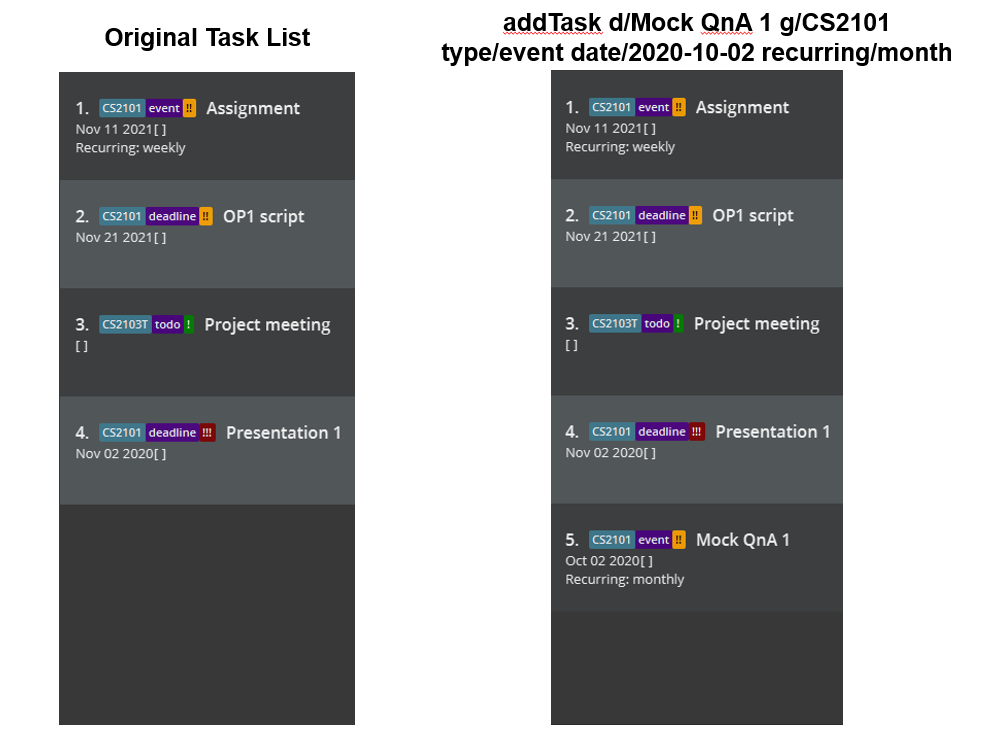

### Project: SWEe-book

SWEe-book is a desktop application used for contact and task management pertaining to CS2103T and CS2101 module. The 
user interacts with it using a CLI, and it has a GUI created with JavaFX. It is written in Java.

Given below are my contributions to the project.

* **Enhancements to existing features**:
    * Implement listTasks to reflect in GUI, so that both contacts and tasks are simultaneously displayed [#49](https://github.com/AY2122S1-CS2103T-W12-2/tp/pull/49)

* **New Feature**: Added the ability to list all tasks added. [#37](https://github.com/AY2122S1-CS2103T-W12-2/tp/pull/37), [#46](https://github.com/AY2122S1-CS2103T-W12-2/tp/pull/46), [#50](https://github.com/AY2122S1-CS2103T-W12-2/tp/pull/50)
    * What it does: Allows the user to list all tasks that were previously added to the project.
    * Justification: This feature allows users to view their added tasks, and serves as a start point fetch data for 
      filterTasks and also the tasks appearing on the UI on startup.
    * Highlights: Upon the editing of the UI to include the task section, the tasks are reflected in the GUI rather than
      the CLI.

* **New Feature**: Added the ability to add recurring frequencies to tasks. [#59](https://github.com/AY2122S1-CS2103T-W12-2/tp/pull/59)
    * What it does: Allows the user to add recurring frequencies to their tasks which can be weekly, monthly, or yearly 
      frequencies. For weekly,
      the tasks are repeated on the same day of the week, for monthly the tasks are repeated by the date (DD) every 
      month, for yearly the tasks are repeated by the DD/MM every year.
    * Justification: This feature allows the user to add tasks that can repeat themselves, so that the tasks can update 
      themselves automatically.
    * Highlights: The tasks are updated on the startup of the application, ensuring they are always updated whenever the
      user opens the application.

* **Code contributed**: [RepoSense link](https://nus-cs2103-ay2122s1.github.io/tp-dashboard/?search=CS2103T-W12-2&sort=groupTitle&sortWithin=title&timeframe=commit&mergegroup=&groupSelect=groupByRepos&breakdown=true&checkedFileTypes=docs~functional-code~test-code~other&since=2021-09-17&tabOpen=true&tabType=zoom&tabAuthor=zhenxuantan&tabRepo=AY2122S1-CS2103T-W12-2%2Ftp%5Bmaster%5D&authorshipIsMergeGroup=false&authorshipFileTypes=docs~functional-code~test-code~other&authorshipIsBinaryFileTypeChecked=false&zA=ambroseboo&zR=AY2122S1-CS2103T-W12-2%2Ftp%5Bmaster%5D&zACS=198.05172413793105&zS=2021-09-17&zFS=CS2103T-W12-2&zU=2021-11-07&zMG=false&zFTF=commit&zFGS=groupByRepos&zFR=false&until=2021-11-07)

* **Project management**:
    * Merged and fixed style errors on pull request #5 and #139 into the team's repository

* **Documentation**:
    * User Guide:
        * Added initial documentation for `addTask`, `deleteTask`, `listTasks`, `filterTasks`, `sortTasks`
        * Added full documentation for `listTasks`
        * Updated command summary
        * Updated documentation for `addTask` (explain recurring field), add screenshots
    * Developer Guide:
        * Added documentation for implementation of `recurring` feature in `Task`
            * Including sequence diagram and activity diagram for recurring frequency

* **Community**:
    * Helped to spot bugs in Practical Examinations - Dry Run (PE-D) [Issues](https://github.com/ambroseboo/ped/issues)

## **Contributions to the Developer Guide (Extracts)**:
### Recurring Tasks feature
#### Implementation
The recurring task feature allows users to add tasks that can be repeated by week, month, or year. It is facilitated
by `RecurringFrequency`, which is a optional component of `Task`. Additionally, the following operations are implemented
in `Task`, `TaskList`, `TaskRecords` and `Date`:
* `Task#updateRecurringTaskDate()` - Task updates its Date to the current week/month/year, based on the
  recurringFrequency of the Task.
* `Date#isLastWeek()`, `Date#isLastMonth()`, `Date#isLastYear()` - Checks current Date of Task against real-time date.
* `Date#getDateForThisWeek()`, `Date#getDateForThisMonth()`, `Date#getDateForThisYear()` - Updates Date to be within
  current week/month/year.
* `TaskList#updateRecurringTasksDates()` - Iterates through list of Tasks and updates its Date if Task is recurring.
* `TaskRecords#updateRecurringTasks()` - Calls for TaskList to update recurring Tasks.

`TaskRecords#updateRecurringTasks()` is used in the `ModelManager` on boot-up of the application to update all Tasks, if
required. Below is a sequence diagram after the initialisation of the `ModelManager`:

Do note that `Date` is required for a `Task` to be recurring. Notably, `Date` is optional for `Todo`.

Given below is an example usage scenario of how a recurring task is added and how it behaves upon re-launching of
the SWEe-book application.

* Step 1. The user launches the application. A recurring `Task` is added, where the user specifies the
  `recurringFrequency` to be weekly, and the `Date` to be from the previous week. The `Task` is added, but the `Date` is
  not updated yet, even if it is not of the current week. The `recurringFrequency` of the task is marked as `week`.
* Step 2. The user re-launches the application. `ModelManager` calls `TaskRecords#updateRecurringTasks()`, which then
  calls `TaskList#updateRecurringTasksDates()`, which then calls `Task#updateRecurringTaskDate()` on the task added.
  Since the `Task` added was recurring (its `recurringFrequency` is marked as `week`, its `Date` is updated to the
  current week, with the same day.
* Step 3. The user then launches the application a week after. The `Task` is updated similarly to Step 2, and since it
  is checked against real-time, it is updated to the current week.

Given below is an activity diagram when a user adds a recurring task and restarts his SWEe-book application.

#### Alternative considerations
* Alternative 1: Let the user choose when to refresh his tasks to their new dates, rather than on start-up of the 
  application.
    * Pros: Allows user more control over their recurring tasks
    * Cons: Less intuitive since tasks are not updated to real-time, having a refresh command just for recurring tasks
      is not ideal.

## **Contributions to the User Guide (Extracts)**:
#### Adding a Task : `addTask`

Adds a new task to SWEe-book.

Format: `addTask d/DESCRIPTION g/GROUP type/TYPE [date/DATE] [pty/PRIORITY] [recurring/RECURRING_FREQUENCY]`
* `GROUP` refers to one of the 2 groups: `CS2101` or `CS2103T`
* `TYPE` refers to one of the 3 types of tasks: `todo`, `event` or `deadline`
* `DATE` is in YYYY-MM-DD format and is only needed for events or deadlines (i.e. `DATE` is optional for Todo tasks)
* `PRIORITY` refers to one of the 3 levels of priorities / importance of the task: `low`, `med` (default) or `high`
* `RECURRING_FREQUENCY` refers to one of the 3 different frequencies that the task could occur: `week`, `month` or 
  `year` (where `week` means that the task is recurring weekly)
    * Any Task that has a recurring frequency must have a date as well, for example a Todo with recurring frequency must
      have a date.

Examples:
* `addTask d/Project meeting g/CS2103T type/todo pty/low`
    * Add a non-recurring `todo` with no date and `low` priority and
      task description `Project meeting` to the group `CS2103T`
      
      
* `addTask d/Presentation 1 g/CS2101 type/deadline date/2020-11-02 pty/high`
    * Add a non-recurring `deadline` due on `2020-11-02`
      with `high` priority and task description `Presentation 1`to the group `CS2101`
      

* `addTask d/Mock QnA 1 g/CS2101 type/event date/2020-10-02 recurring/month`
    * Add a `event` that recurs every `month` with
      date `2020-10-02` and default `med` priority and task description `Mock QnA` to the group `CS2101`
      
      
